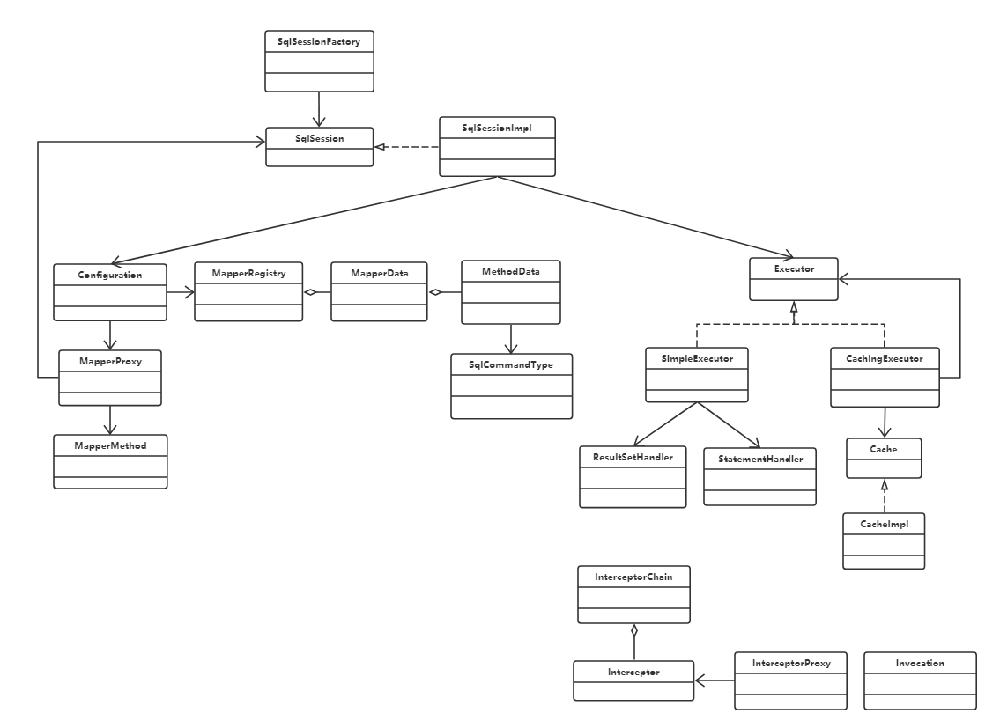

# 手写简易版mybatis

### 1.简介

  本项目是参考mybatis的源代码，通过注解实现对数据的增删改查的操作。
  目的是加深对mybatis运行机制的了解。代码比较简陋，功能不完善，仅供学习参考。

### 2.功能介绍

#### 2.1 已经实现的功能如下：
  - 数据库连接自定义配置
  - 通过注解获取sql
  - sql中参数为基本类型的增删改查（查询的返回类型是实体类或者集合类）
  - 一级缓存（默认开启）
  - Executor层面的拦截功能（插件）
  
#### 2.2 后续时间允许的话想实现的功能：
  - _懒加载（需要用到cglib动态代理）_
  - _sql语句中参数为引用类型的增删改查_
  - _返回类型是Map的查询_

### 3. 如何使用

#### 3.1 数据库连接配置
  在`resources/META-INF/mabatis/`目录下新建一个properties文件（**文件名自由定义**），配置数据库连接。

示例代码：jdbc.properties
```
  database=postgres
  database.url=jdbc:postgresql://localhost:5432/
  database.username=postgres
  database.password=123456
  database.driverClassName=org.postgresql.Driver
```

#### 3.2 定义数据库操作接口

  数据库操作接口必须要用`@Mapper`注解
  
  示例代码：UserMapper
```
/**
 * 用户数据库操作接口
 */
@Mapper
public interface UserMapper {
	/**
	 * 通过id查询用户
	 * 
	 * @param id ID
	 * @return 用户
	 */
	@Select("SELECT * FROM t_user WHERE id = ?")
	public User selectOne(int id);
}
```


#### 3.3 初始化配置中心

  示例代码：
```
Configuration config = new Configuration();
// 添加mapper
config.addMapper(UserMapper.class);
```

#### 3.4 执行

  创建session会话并动态生成Mapper接口代理实现类后调用接口方法执行数据库操作。

  示例代码：
```
SqlSession sqlSession = SqlSessionFactory.createSqlSession(config);
UserMapper userMapper = sqlSession.getMapper(UserMapper.class);
User user = userMapper.selectOne(1);
```

### 4. Executor层面的拦截功能(插件)
  
  定义一个类实现`Interceptor`接口，添加`@Intercepts`,`@Signature`注解，将该拦截器加到配置中心即可

  添加拦截器示例代码：
```
// 添加拦截器
config.addInterceptor(new ExecutorQueryPlugin());
config.addInterceptor(new ExecutorUpdatePlugin());
```

  自定义拦插件示例代码
```
/**
 * 执行器拦截插件<br>
 * 拦截查询方法
 */
@Intercepts({@Signature(type = Executor.class, method = "doQuery", args = { String.class, Object.class, Class.class }) })
public class ExecutorQueryPlugin implements Interceptor
```

### 5. 类图概览



